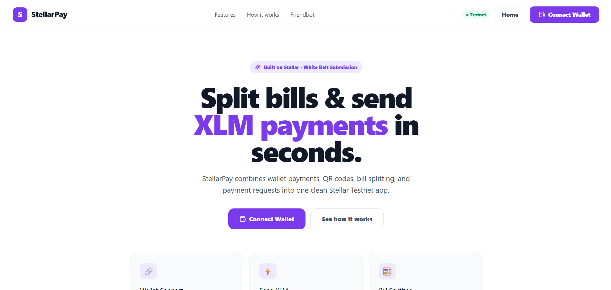
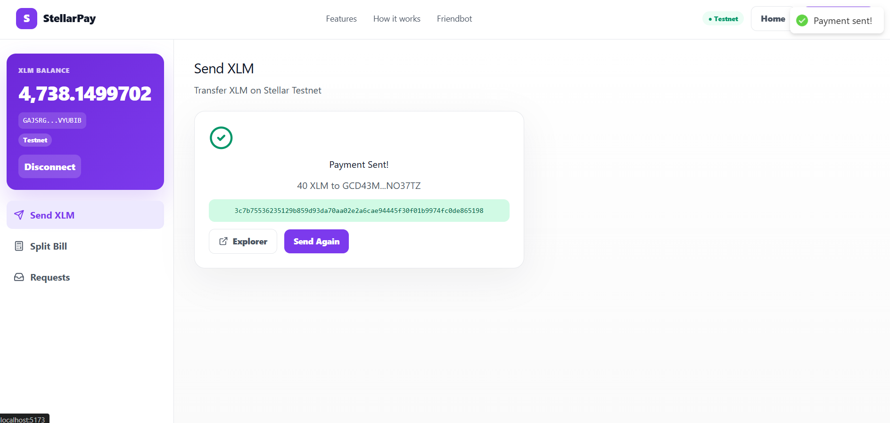
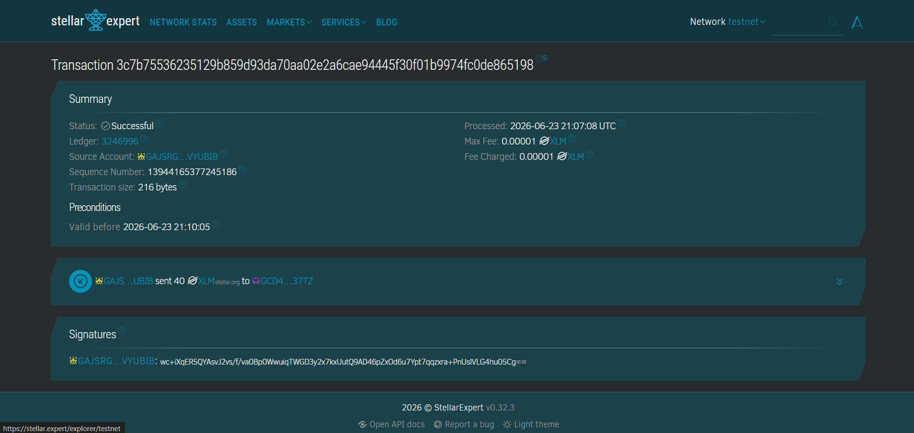
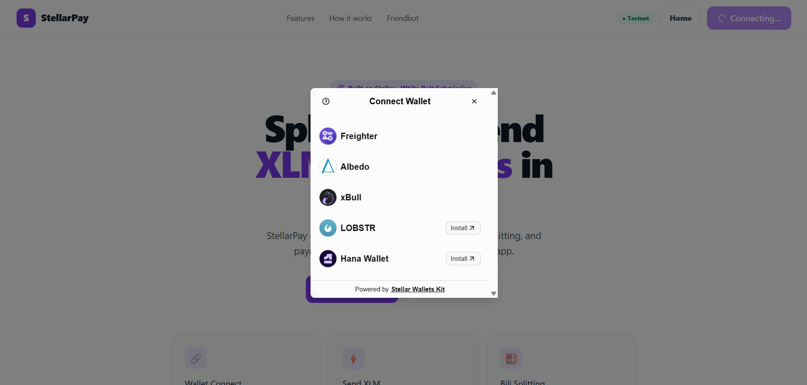
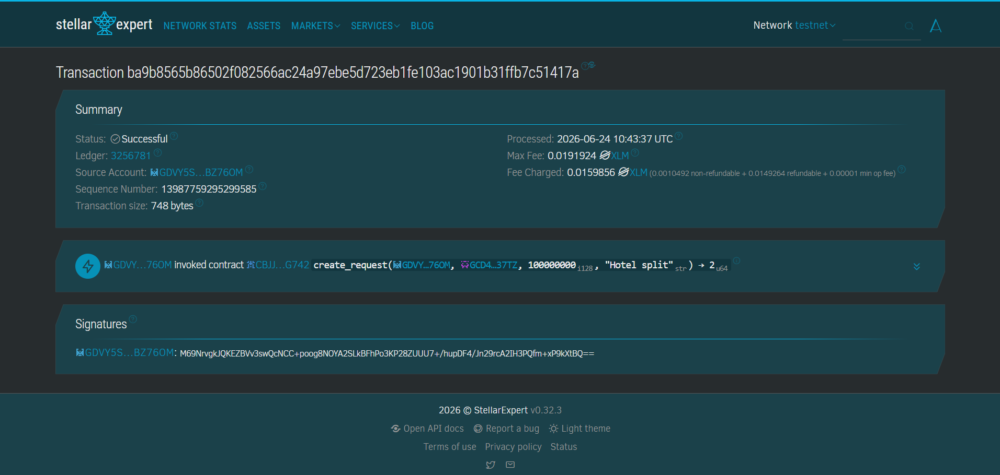

# StellarPay – Smart Bill Splitting & QR Payments on Stellar

Split bills, send payment requests, and pay instantly with QR links on Stellar Testnet.

---

## ⚪️ Level 1 - White Belt Submission

### 👉 Overview
This section covers the foundational integration with the Stellar Testnet. It provides basic wallet connectivity, balance tracking, and native XLM transfers.

### Features
- Freighter wallet connect / disconnect
- Live XLM balance from Horizon Testnet
- Send XLM with memo support and Stellar Expert transaction links
- Equal and custom bill splitting
- Local payment request inbox
- QR payment links and public `/pay` page

### Tech Stack
React 18 · TypeScript · Vite · Tailwind CSS · Stellar SDK · Freighter API · Zustand · qrcode.react

### ✅ Requirements Met
- **Freighter wallet connect / disconnect:** Yes.
- **Live XLM balance from Horizon Testnet:** Yes.
- **Send XLM with memo support:** Yes.
- **Equal and custom bill splitting UI:** Yes.
- **QR payment links and public `/pay` page:** Yes.

---

## 🟡 Level 2 - Yellow Belt Submission

### 👉 Overview
Building on the White Belt skills, this project integrates multiple wallets, features a custom deployed smart contract, and implements real-time event handling.
**Focus:** Multi-wallet integration, smart contract deployment, and real-time data synchronization.

**What is implemented in this submission:**
- `StellarWalletsKit` implementation with multiple wallets (Freighter, Albedo, xBull, Lobstr, Hana).
- Error handling (wallet not found, rejected, wrong network).
- Deployed a custom Soroban smart contract to the testnet.
- Calling contract functions directly from the React frontend.
- Reading and writing data to the contract.
- Event listening and state synchronization (live feed).
- Transaction status tracking (pending/success/fail) using a global store.

### Tech Stack Additions
Stellar Wallets Kit · Soroban Smart Contracts (Rust)

### ✅ Requirements Met
- **3 error types handled:** Yes (User Rejected, Wrong Network, Simulation Failed/Unauthorized).
- **Contract deployed on testnet:** Yes (See details below).
- **Contract called from the frontend:** Yes (Create Request & Mark Paid).
- **Transaction status visible:** Yes (Bottom-right toast tracker).
- **Multi-wallet app:** Yes.
- **Real-time event integration:** Yes.

### 📝 Contract Details
- **Deployed Contract Address:** `CBJJMXJVIXE6ZAK7WBOFX46ATAEJEXRJUNETL5RXR7J6LF35GMN3G742` (Stellar Testnet)

### 🔗 Transaction hash of a contract call
- **Hash:** `ba9b8565b86502f082566ac24a97ebe5d723eb1fe103ac1901b31ffb7c51417a` *(Verifiable on Stellar Explorer)*


---

## Setup

```bash
npm install
cp .env.example .env
npm run dev
```

Open `http://localhost:5173`, install Freighter (or any supported wallet), switch it to Testnet, and fund your wallet with Friendbot:

```text
https://friendbot.stellar.org/?addr=YOUR_PUBLIC_KEY
```

## Environment

```env
VITE_STELLAR_NETWORK=TESTNET
VITE_HORIZON_URL=https://horizon-testnet.stellar.org
VITE_APP_URL=http://localhost:5173
```

## Build

```bash
npm run build
```

## Screenshots

### Level 1 Screenshots

#### Landing Page


#### Wallet Connected & Transaction Result
*(Includes Wallet connected state, Balance displayed, and Transaction result shown to the user)*


#### Successful Testnet Transaction (Level 1)
*(Stellar Expert Explorer View)*


### Level 2 Screenshots

#### Wallet Options Available
*(Showcase the @creit.tech/stellar-wallets-kit modal with wallet options)*


#### Successful Testnet Transaction (Level 2 Contract Call)
*(Stellar Expert Explorer View)*

