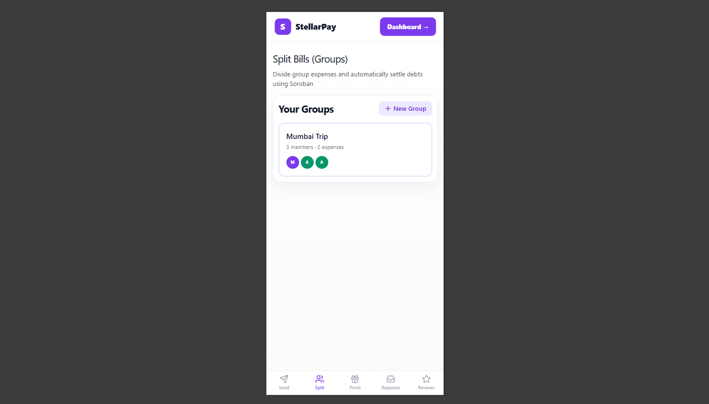
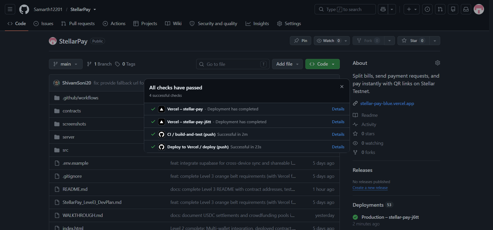
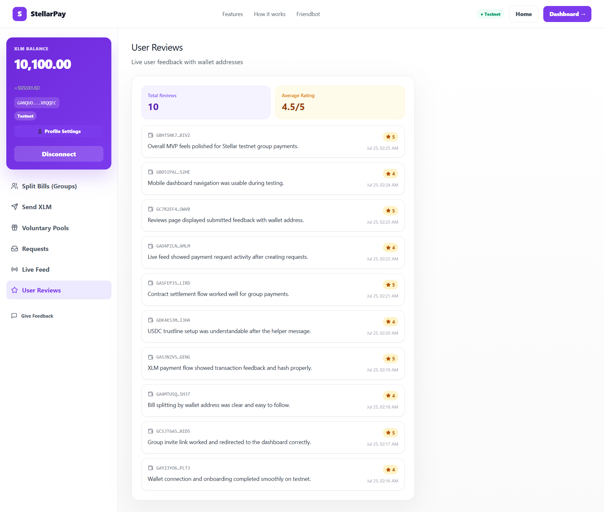
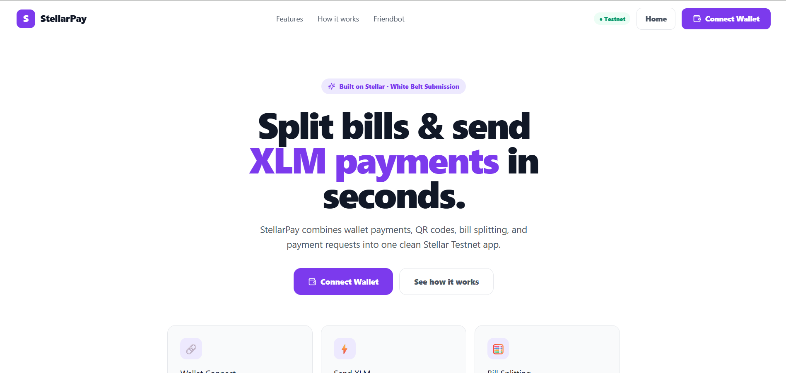
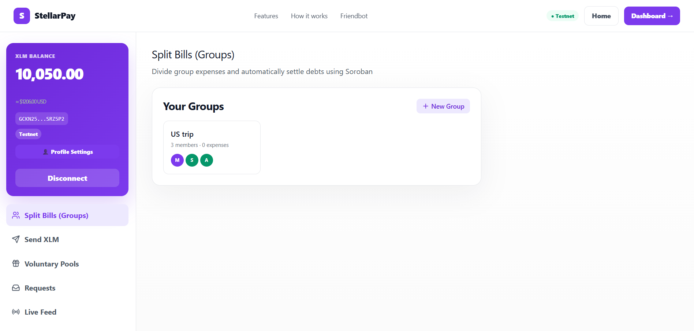
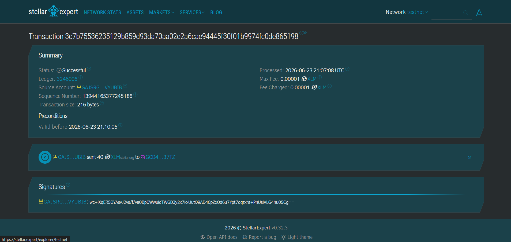
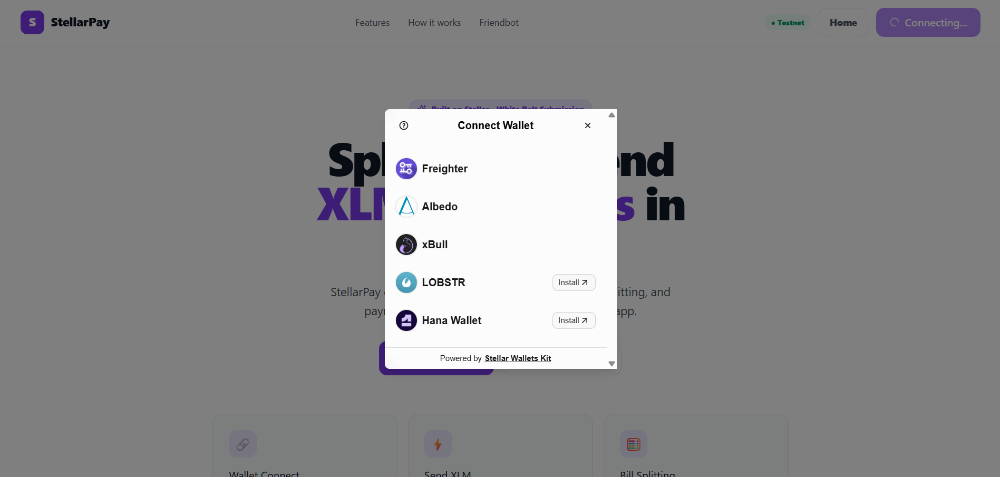
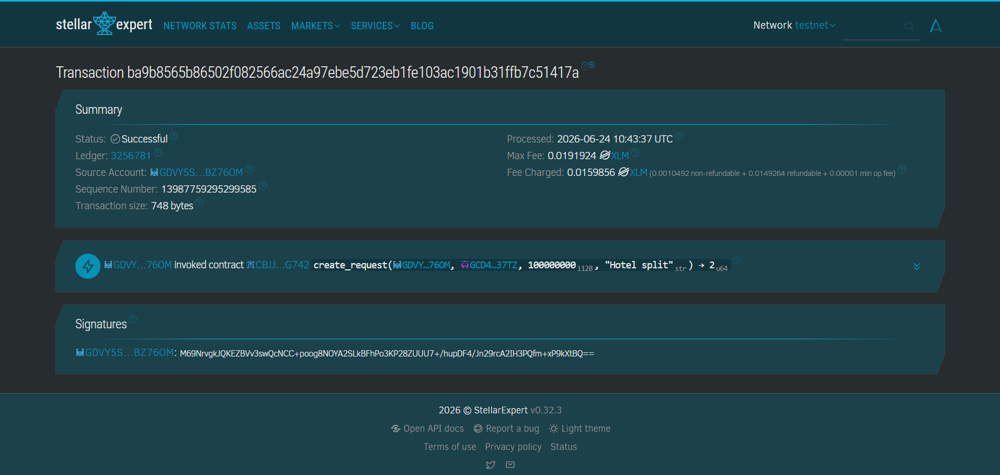

# StellarPay – Smart Bill Splitting & QR Payments on Stellar

[](https://github.com/Samarth12201/StellarPay/actions/workflows/ci.yml)
[](https://github.com/Samarth12201/StellarPay/actions/workflows/deploy.yml)


## Video Walkthrough

<a href="https://youtu.be/hoRQ8aC3_oU" target="_blank">
  
</a>

*Click the banner above to watch the full project walkthrough.*

### 📱 Mobile Responsive UI & 🚀 CI/CD Pipeline Status

<table>
  <tr>
    <td width="50%" align="center">
      <b>Mobile Responsive UI</b><br/><br/>
      
    </td>
    <td width="50%" align="center">
      <b>CI/CD Pipeline Passing</b><br/><br/>
      
    </td>
  </tr>
</table>

### Analytics & Monitoring

StellarPay uses Vercel Web Analytics for page views and visitor insights, and Vercel Speed Insights for frontend performance monitoring.


Split bills, send payment requests, and pay instantly with QR links on Stellar Testnet.

---

## ⚪️ Level 1 - White Belt Submission

### 👉 Overview
This section covers the foundational integration with the Stellar Testnet. It provides basic wallet connectivity, balance tracking, and native XLM transfers.

### Features
- Freighter wallet connect / disconnect
- Live XLM balance from Horizon Testnet
- Send XLM with memo support and Stellar Expert transaction links
- Equal and custom bill splitting
- Local payment request inbox
- QR payment links and public `/pay` page

### Tech Stack
React 18 · TypeScript · Vite · Tailwind CSS · Stellar SDK · Freighter API · Zustand · qrcode.react

### ✅ Requirements Met
- **Freighter wallet connect / disconnect:** Yes.
- **Live XLM balance from Horizon Testnet:** Yes.
- **Send XLM with memo support:** Yes.
- **Equal and custom bill splitting UI:** Yes.
- **QR payment links and public `/pay` page:** Yes.

---

## 🟡 Level 2 - Yellow Belt Submission

### 👉 Overview
Building on the White Belt skills, this project integrates multiple wallets, features a custom deployed smart contract, and implements real-time event handling.
**Focus:** Multi-wallet integration, smart contract deployment, and real-time data synchronization.

**What is implemented in this submission:**
- `StellarWalletsKit` implementation with multiple wallets (Freighter, Albedo, xBull, Lobstr, Hana).
- Error handling (wallet not found, rejected, wrong network).
- Deployed a custom Soroban smart contract to the testnet.
- Calling contract functions directly from the React frontend.
- Reading and writing data to the contract.
- Event listening and state synchronization (live feed).
- Transaction status tracking (pending/success/fail) using a global store.

### Tech Stack Additions
Stellar Wallets Kit · Soroban Smart Contracts (Rust)

### ✅ Requirements Met
- **3 error types handled:** Yes (User Rejected, Wrong Network, Simulation Failed/Unauthorized).
- **Contract deployed on testnet:** Yes (See details below).
- **Contract called from the frontend:** Yes (Create Request & Mark Paid).
- **Transaction status visible:** Yes (Bottom-right toast tracker).
- **Multi-wallet app:** Yes.
- **Real-time event integration:** Yes.

### 📝 Contract Details
- **Deployed Contract Address:** `CBJJMXJVIXE6ZAK7WBOFX46ATAEJEXRJUNETL5RXR7J6LF35GMN3G742` (Stellar Testnet)

### 🔗 Transaction hash of a contract call
- **Hash:** `ba9b8565b86502f082566ac24a97ebe5d723eb1fe103ac1901b31ffb7c51417a` *(Verifiable on Stellar Explorer)*


---

## 🟠 Level 3 - Orange Belt Submission

### 👉 Overview
Production-grade decentralized group expense settlement dApp with multi-contract architecture, USDC stablecoin support, crowdfunding escrow pools, automated CI/CD, and responsive mobile-first UI.

**Focus:** Advanced smart contracts, inter-contract communication, CI/CD pipelines, production architecture, and comprehensive testing.

### What is implemented in this submission:
- **GroupExpense Smart Contract (Rust/Soroban):** On-chain group creation, expense tracking, pool escrow, and USDC settlements via inter-contract calls.
- **Inter-Contract Communication:** The `settle_expense_with_token` function calls the USDC SAC (Stellar Asset Contract) via `token::Client` for atomic cross-contract token transfers.
- **Crowdfunded Escrow Pools:** Users create on-chain voluntary donation campaigns. Contributions are held in contract escrow; only the creator can withdraw.
- **USDC Stablecoin Settlements:** Full support for Circle Testnet USDC (SEP-41 SAC) alongside native XLM for expense splits and pool contributions.
- **Settlement Engine:** Minimum-transaction path algorithm ("net balance") to calculate fewest possible payments.
- **Comprehensive Testing:** 17 frontend unit tests (Vitest) + 3 Rust contract unit tests (cargo test).
- **CI/CD Pipeline:** GitHub Actions for automated typecheck, testing, and Vercel deployment on every push.
- **Mobile-Responsive UI:** Bottom navigation bar, responsive layouts, touch-friendly controls.
- **Real-Time Sync:** Supabase cloud sync + real-time subscription for cross-device payment request notifications.
- **Error Handling & Loading States:** Global `ErrorBoundary`, transaction status tracker, skeleton loading, toast notifications.

### ✅ Requirements Met
| Requirement | Status | Details |
|---|---|---|
| Advanced smart contract development | ✅ | GroupExpense contract with pools, escrow, settlements |
| Inter-contract communication | ✅ | `settle_expense_with_token` calls USDC SAC contract |
| Event streaming & real-time updates | ✅ | Supabase realtime + contract event feed |
| CI/CD pipeline setup | ✅ | `.github/workflows/ci.yml` + `deploy.yml` |
| Smart contract deployment workflow | ✅ | Compiled, optimized, deployed via Stellar CLI |
| Mobile responsive frontend | ✅ | `MobileNav` + Tailwind responsive classes |
| Error handling & loading states | ✅ | ErrorBoundary, TxStatusBar, toast notifications |
| Tests for contracts and frontend | ✅ | 17 Vitest tests + 3 Rust contract tests |
| Production-ready architecture | ✅ | Zustand stores, Supabase sync, env config |
| Documentation & walkthrough | ✅ | Full README, video walkthrough, screenshots |

### 📝 Contract Details

**Payment Request Contract (Level 2):**
- **Address:** `CBJJMXJVIXE6ZAK7WBOFX46ATAEJEXRJUNETL5RXR7J6LF35GMN3G742`
- **Tx Hash:** `ba9b8565b86502f082566ac24a97ebe5d723eb1fe103ac1901b31ffb7c51417a`

**Group Expense & Pools Contract (Level 3):**
- **Address:** `CCXGCUR7WRG75FT3M4DW763MMQW6ZHDFRPHVX6L5W67MWY3ED5YVBELB`
- **Functions:** `create_group`, `add_expense`, `settle_expense`, `settle_expense_with_token`, `create_pool`, `contribute_pool`, `withdraw_pool`

**USDC SAC Contract (Circle Testnet):**
- **Address:** `CBIELTK6YBZJU5UP2WWQEUCYKLPU6AUNZ2BQ4WWFEIE3USCIHMXQDAMA`
- **Issuer:** `GBBD47IF6LWK7P7MDEVSCWR7DPUWV3NY3DTQEVFL4NAT4AQH3ZLLFLA5`

### 🔗 Links
- **Live App:** [https://stellar-pay-blue.vercel.app/](https://stellar-pay-blue.vercel.app/)
- **GitHub:** [https://github.com/Samarth12201/StellarPay](https://github.com/Samarth12201/StellarPay)
- **CI/CD:** [GitHub Actions](https://github.com/Samarth12201/StellarPay/actions)

### 🧪 Running Tests

```bash
# Frontend tests (17 tests)
npm run test

# Rust contract tests (3 tests)
cd contracts/group_expense && cargo test
```

---

## Level 4 - Green Belt Submission

### Overview
This phase transforms StellarPay into a production-ready MVP for Stellar testnet users. It focuses on wallet onboarding, group invite flows, mobile responsiveness, USDC/XLM settlement, product analytics, and feedback collection with wallet-address proof.

### What is implemented in this submission:
- **PWA Support:** Full Progressive Web App implementation using `vite-plugin-pwa` for mobile installation.
- **Multi-Currency (FX Rates):** Real-time fiat conversions (USD, INR, MXN, PHP, EUR, GBP) alongside XLM balances, powered by the CoinGecko API.
- **User Profiles & Onboarding:** Supabase-backed profiles with username, wallet address, avatar color, and preferred currency.
- **Group Invite Links:** Secure, shareable invite links using `nanoid` that let users join groups with their Stellar wallet address.
- **Wallet-Based Bill Splitting:** Group members are added and settled using Stellar public keys, not name-only records.
- **USDC + XLM Settlement:** Users can track balances and settle group expenses in Circle Testnet USDC or native XLM.
- **Live Activity Feed:** Payment requests and contract events appear in a combined live feed.
- **Feedback Collection:** Connected users can submit ratings and feedback, stored with their wallet address in Supabase.
- **Reviews Dashboard:** The app includes a User Reviews page showing feedback, ratings, timestamps, and wallet addresses.
- **Analytics & Monitoring:** Vercel Web Analytics, custom events, and Speed Insights are integrated for usage/performance monitoring.
- **Supabase RLS:** Row Level Security policies are implemented for profiles, group invitations, requests, pools, and feedback.

### Requirements Met
| Requirement | Status | Details |
|---|---|---|
| Production MVP | Done | Full app deployed on Vercel with wallet, group, payment, request, review, and analytics flows |
| Mobile responsive UI | Done | Responsive dashboard, groups, pools, requests, reviews, and mobile nav |
| Loading states and error handling | Done | Wallet errors, transaction status bar, toasts, ErrorBoundary, trustline errors |
| User onboarding | Done | Wallet connect, profile creation, preferred currency, protected dashboard routing |
| Proof of wallet interactions | Done | 10 Stellar testnet USDC transactions listed below |
| Feedback collection | Done | Feedback modal stores wallet address, rating, feedback, and timestamp |
| Monitoring and analytics | Done | Vercel Analytics + Speed Insights, plus custom app events |
| Smart contracts on testnet | Done | PaymentRequest and GroupExpense contracts deployed on Stellar testnet |
| USDC support | Done | USDC balances, trustline helper, and contract settlement flow |
| User profiles | Done | Username, preferred currency, and avatar per address |
| FX rate display | Done | Live CoinGecko rates across the app via FX badges |
| Mobile PWA | Done | Installable PWA with offline-ready manifest |
| Group invite links | Done | `/invite/:code` allows sharing and joining groups |
| Supabase RLS | Done | Security policies for Supabase-backed app tables |

### Level 4 Links
- **Live App:** [https://stellar-pay-blue.vercel.app/](https://stellar-pay-blue.vercel.app/)
- **GitHub Repository:** [https://github.com/Samarth12201/StellarPay](https://github.com/Samarth12201/StellarPay)
- **Video Walkthrough:** [https://youtu.be/hoRQ8aC3_oU](https://youtu.be/hoRQ8aC3_oU)

### Level 4 Contract Addresses
- **Payment Request Contract:** `CBJJMXJVIXE6ZAK7WBOFX46ATAEJEXRJUNETL5RXR7J6LF35GMN3G742`
- **Group Expense Contract:** `CCXGCUR7WRG75FT3M4DW763MMQW6ZHDFRPHVX6L5W67MWY3ED5YVBELB`
- **Circle Testnet USDC SAC:** `CBIELTK6YBZJU5UP2WWQEUCYKLPU6AUNZ2BQ4WWFEIE3USCIHMXQDAMA`
- **Circle Testnet USDC Issuer:** `GBBD47IF6LWK7P7MDEVSCWR7DPUWV3NY3DTQEVFL4NAT4AQH3ZLLFLA5`

### Proof of 10+ Wallet Interactions
The following Stellar testnet transactions demonstrate wallet-to-wallet USDC interactions used for Level 4 validation.

| # | Wallet Address | Amount | Transaction |
|---|---|---:|---|
| 1 | `GA4MTUSQ4UHGNASTPXJIEZGZXDFGKJHM5EQPQZKIGSKB32KY4O7F5H37` | 500 USDC | [53eac47b273076a15deaf8f157b84993f5f379d1b92a1b4a4a5e2762648ed35b](https://stellar.expert/explorer/testnet/tx/53eac47b273076a15deaf8f157b84993f5f379d1b92a1b4a4a5e2762648ed35b) |
| 2 | `GAS3NZV5GPR32HJKCLJXKFCM74BSD5RFO3QEBZHQDIG3EVJCWI5PGENG` | 500 USDC | [f66b500b3486998f97b28f5bbfffc53901278f61970f8ee0796c24a4e10e4bcb](https://stellar.expert/explorer/testnet/tx/f66b500b3486998f97b28f5bbfffc53901278f61970f8ee0796c24a4e10e4bcb) |
| 3 | `GDK4KS3MWDB7T4QFQXTVDKBC3DNTL2HC7I5YC4WJUCGZVEN3WYLVI3H4` | 500 USDC | [cbfe7dff929103c490e0ea61ef7c3b45ef36914ea0cf7a0a2d7a554248b0c7c4](https://stellar.expert/explorer/testnet/tx/cbfe7dff929103c490e0ea61ef7c3b45ef36914ea0cf7a0a2d7a554248b0c7c4) |
| 4 | `GASFEP35SANIUV6S6P4ZRO3ZIQNBKIN3S7DMJDX7UGJQHYZYVRQTLIRD` | 500 USDC | [026cdd292f0379bf08197832739c75b1eb3e72feab0c2bdae61f30db4fda2f6f](https://stellar.expert/explorer/testnet/tx/026cdd292f0379bf08197832739c75b1eb3e72feab0c2bdae61f30db4fda2f6f) |
| 5 | `GAO4PZLNKD6UQWGTQGGNKJSCYLV3OSRI2UGB6N2KUYAUBSZIFLZEAMLM` | 500 USDC | [222fab3093ae59788d4bec4459e1609903a3fcfad234c619b8ed6f7f7691ea74](https://stellar.expert/explorer/testnet/tx/222fab3093ae59788d4bec4459e1609903a3fcfad234c619b8ed6f7f7691ea74) |
| 6 | `GC7R2EF4KDUVUMNXFGH4BKXXJQQ4YKHGJ4RVLZ4I6P4LPF56LKWGOWVB` | 500 USDC | [8ce7766073e32ff0a1c0aa9ce471d8bc4083cd8f7944cc0733221c8411070bfb](https://stellar.expert/explorer/testnet/tx/8ce7766073e32ff0a1c0aa9ce471d8bc4083cd8f7944cc0733221c8411070bfb) |
| 7 | `GBD5IPALADNFOA62NM3LBAO6LUTOP7GY3HJYL3Z62NF5GK62EPG6S2HE` | 500 USDC | [a7a72647e8ba7a638b5628c68869578220e463cc8aca33d347aae5b9eb38832f](https://stellar.expert/explorer/testnet/tx/a7a72647e8ba7a638b5628c68869578220e463cc8aca33d347aae5b9eb38832f) |
| 8 | `GBHTSNK7HGDWW5LKFDMTGSFGT3FZYROKKGKPLK42GIOG55GNMEKPBIV2` | 500 USDC | [694d055e5f3108e0a202acef0a924be918ab4f5080fc0d30025b07e871c20add](https://stellar.expert/explorer/testnet/tx/694d055e5f3108e0a202acef0a924be918ab4f5080fc0d30025b07e871c20add) |
| 9 | `GCSJT6A5YZJT6SGD4TB226LR7RHOGP7VXTN5DWVC5J5LAQSI5MEMNID5` | 500 USDC | [4c3718fd67a0bacec190407dc4f5b36ba37863bc913057dc6fa0dcf91b01a580](https://stellar.expert/explorer/testnet/tx/4c3718fd67a0bacec190407dc4f5b36ba37863bc913057dc6fa0dcf91b01a580) |
| 10 | `GA4MTUSQ4UHGNASTPXJIEZGZXDFGKJHM5EQPQZKIGSKB32KY4O7F5H37` | 1 USDC | [5f991645e56fa9198296616847ef26d63e709591d4ed77759c519ce055281aed](https://stellar.expert/explorer/testnet/tx/5f991645e56fa9198296616847ef26d63e709591d4ed77759c519ce055281aed) |

### User Feedback Summary
StellarPay includes in-app feedback collection for product validation. Each feedback entry is stored in Supabase with wallet address, rating, written feedback, and timestamp. The dashboard also includes a **User Reviews** tab to view feedback live from the app UI.



| # | Wallet Address | Rating | Feedback |
|---|---|---:|---|
| 1 | `GAY23YO6OSNEGKJZDE4AXNFNWVCGGHFTZT3OP3QLRDHG7CFBG4LSPLT3` | 4/5 | Wallet connection and onboarding completed smoothly on testnet. |
| 2 | `GCSJT6A5YZJT6SGD4TB226LR7RHOGP7VXTN5DWVC5J5LAQSI5MEMNID5` | 5/5 | Group invite link worked and redirected to the dashboard correctly. |
| 3 | `GA4MTUSQ4UHGNASTPXJIEZGZXDFGKJHM5EQPQZKIGSKB32KY4O7F5H37` | 4/5 | Bill splitting by wallet address was clear and easy to follow. |
| 4 | `GAS3NZV5GPR32HJKCLJXKFCM74BSD5RFO3QEBZHQDIG3EVJCWI5PGENG` | 5/5 | XLM payment flow showed transaction feedback and hash properly. |
| 5 | `GDK4KS3MWDB7T4QFQXTVDKBC3DNTL2HC7I5YC4WJUCGZVEN3WYLVI3H4` | 4/5 | USDC trustline setup was understandable after the helper message. |
| 6 | `GASFEP35SANIUV6S6P4ZRO3ZIQNBKIN3S7DMJDX7UGJQHYZYVRQTLIRD` | 5/5 | Contract settlement flow worked well for group payments. |
| 7 | `GAO4PZLNKD6UQWGTQGGNKJSCYLV3OSRI2UGB6N2KUYAUBSZIFLZEAMLM` | 4/5 | Live feed showed payment request activity after creating requests. |
| 8 | `GC7R2EF4KDUVUMNXFGH4BKXXJQQ4YKHGJ4RVLZ4I6P4LPF56LKWGOWVB` | 5/5 | Reviews page displayed submitted feedback with wallet address. |
| 9 | `GBD5IPALADNFOA62NM3LBAO6LUTOP7GY3HJYL3Z62NF5GK62EPG6S2HE` | 4/5 | Mobile dashboard navigation was usable during testing. |
| 10 | `GBHTSNK7HGDWW5LKFDMTGSFGT3FZYROKKGKPLK42GIOG55GNMEKPBIV2` | 5/5 | Overall MVP feels polished for Stellar testnet group payments. |

### Level 4 Screenshot Checklist
- **Product UI:** Landing page, dashboard, payment request, group split, and reviews page.
- **Mobile responsive design:** Mobile landing/dashboard and mobile group/payment screens.
- **Analytics or monitoring setup:** Vercel Web Analytics and Speed Insights dashboard.
- **Proof of 10+ wallet interactions:** Stellar Expert transaction list or the wallet interaction table above.
- **Basic feedback summary:** User Reviews page and/or Supabase `user_feedback` table with wallet addresses visible.
- **Video proof:** Video walkthrough thumbnail/link and live Vercel deployment.

## Setup

```bash
npm install
cp .env.example .env
npm run dev
```

Open `http://localhost:5173`, install Freighter (or any supported wallet), switch it to Testnet, and fund your wallet with Friendbot:

```text
https://friendbot.stellar.org/?addr=YOUR_PUBLIC_KEY
```

## Environment

```env
VITE_STELLAR_NETWORK=TESTNET
VITE_HORIZON_URL=https://horizon-testnet.stellar.org
VITE_APP_URL=http://localhost:5173
```

## Build

```bash
npm run build
```

## Screenshots

### Level 1 Screenshots

#### Landing Page


#### Wallet Connected & Transaction Result
*(Includes Wallet connected state, Balance displayed, and Transaction result shown to the user)*


#### Successful Testnet Transaction (Level 1)
*(Stellar Expert Explorer View)*


### Level 2 Screenshots

#### Wallet Options Available
*(Showcase the @creit.tech/stellar-wallets-kit modal with wallet options)*


#### Successful Testnet Transaction (Level 2 Contract Call)
*(Stellar Expert Explorer View)*


